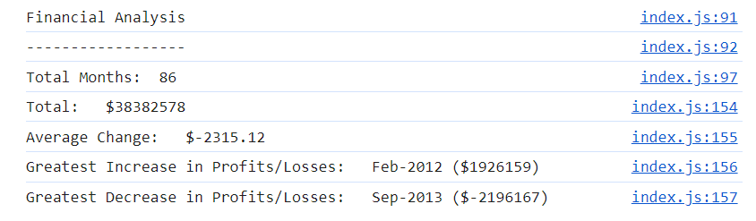

# Console Finances

## Project status
This project is complete.

## Description
A short JavaScript skills challenge for myself to print basic finance calculations in the console, using what I have learned so far on JavaScript. The aim was to better my understanding of JavaScript maths and logic and to put into practice some of the recent concepts I have been exposed to, such as 'loops', 'arrays' and 'if-statements'. The page showcases a few basic calculations on a given array of data of profits and losses per month (for a hypothetical company). To the console, it prints the total months included in the data, the total profit/loss of all the data, the average change in profit/loss and the months which saw the greatest increase and decrease of profit. It makes use of built in JavaScript functions such as '.length' for the number of given months and '.toFixed' for printing numbers to 2 decimal places.

https://rowankinross.github.io/console-finances/

## Visuals
The following image shows the appearance of the console of the application:

## Installation
n/a

## Usage
Opening inspect > console on the deployed page you can find the extracted and calculated data, taken from the given array 'Finances'.

## Contributing
As this is a personal project, designed to challenge and test my skills, I am not currently looking for contributors.

## Credits

edX challenge materials for setting the challenge and providing me with the skills to take on this project.

## License

MIT License - refer to LICENSE in the repo.